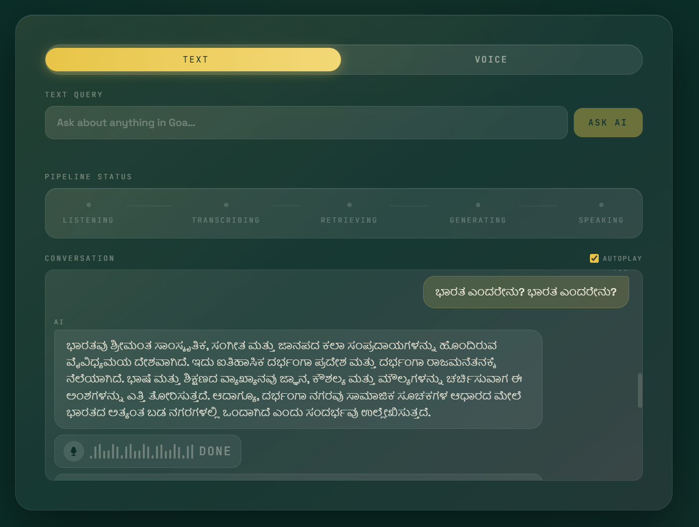
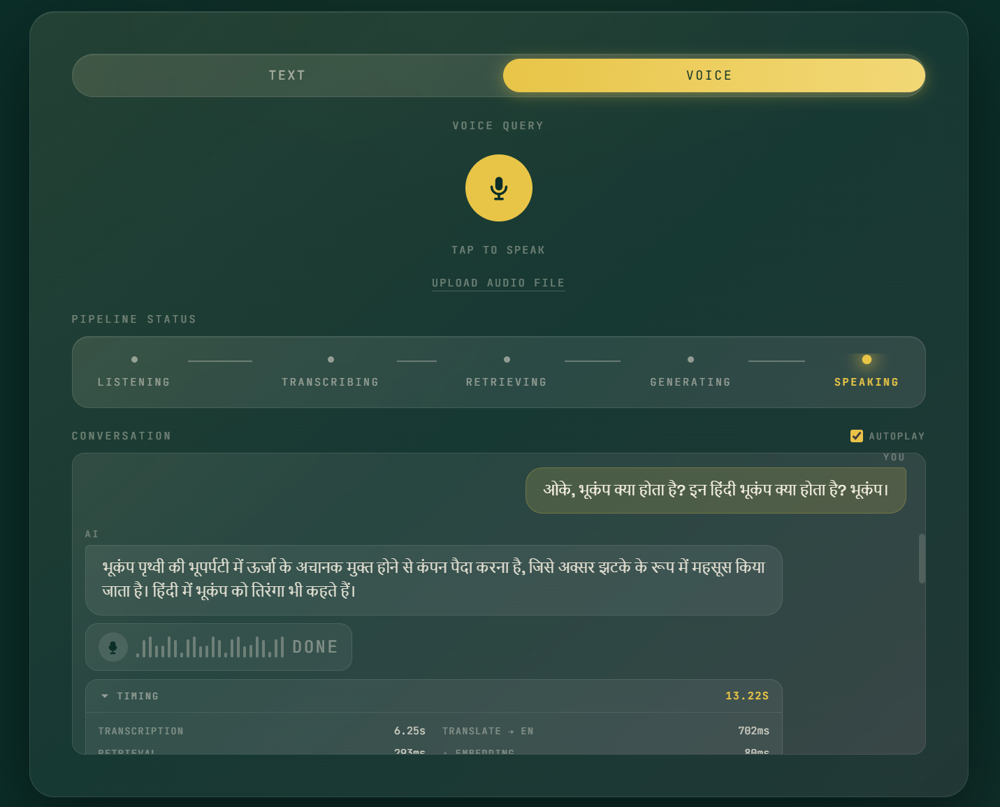
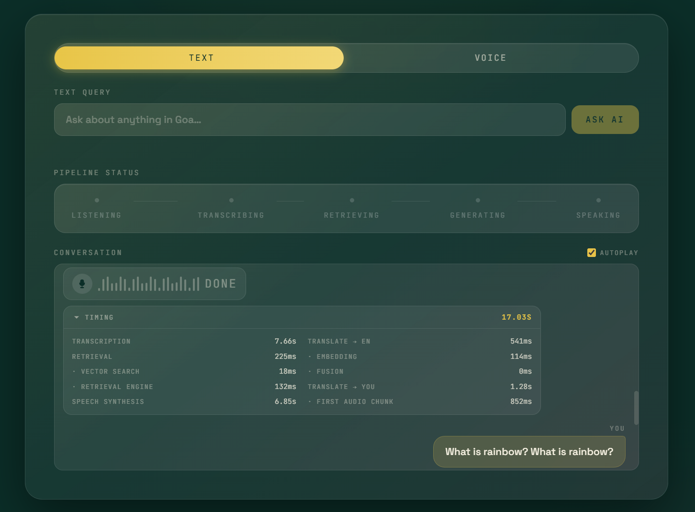
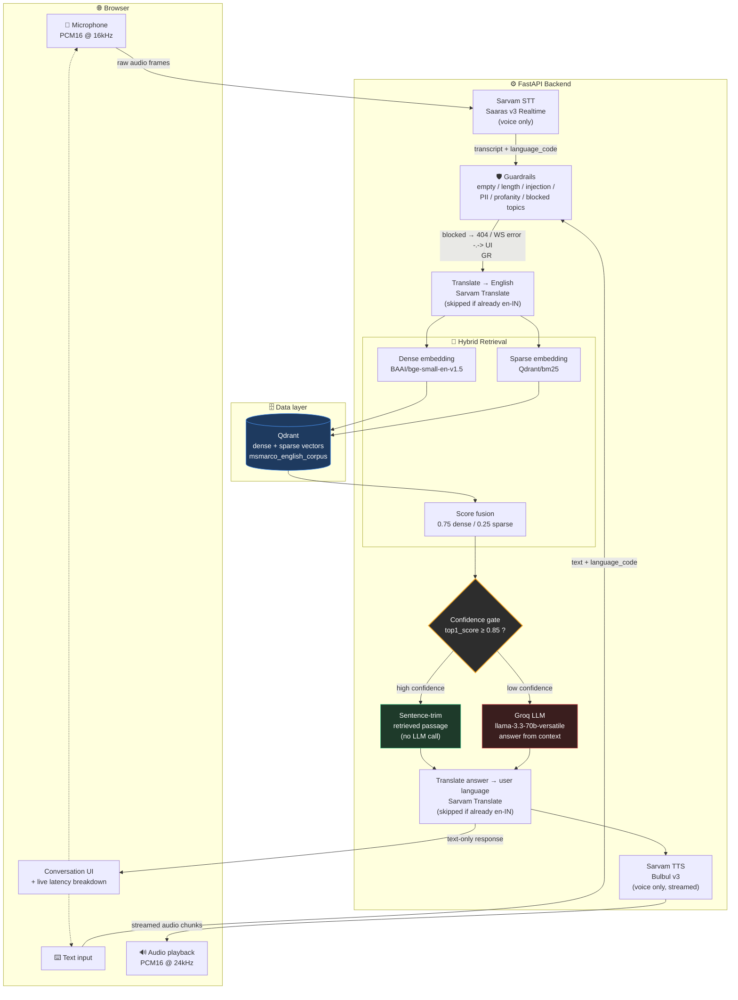
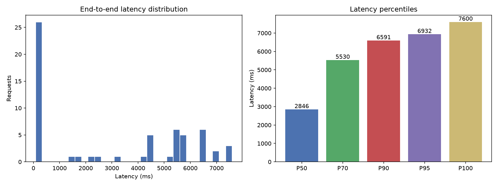
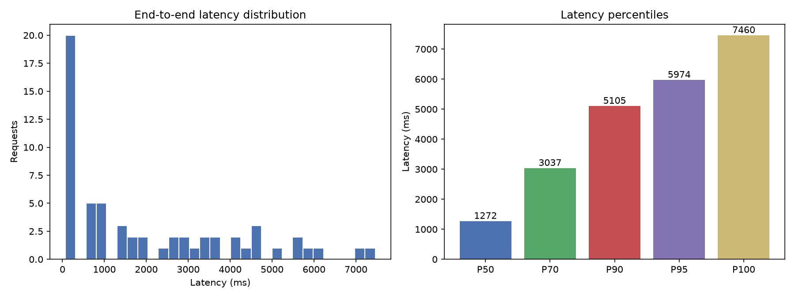

# 🎙️ HHGoa — Retrieval-First Multilingual Voice Assistant

A voice and text knowledge assistant that answers questions in **English, Hindi, Odia, and Tamil**
by combining **hybrid vector retrieval (Qdrant)** with an **LLM fallback (Groq)**, wrapped in a
**Sarvam AI** speech pipeline (STT + TTS) and a React frontend.

The system is retrieval-first: it only calls an LLM when the knowledge base doesn't have a
confident answer, which keeps latency down and grounds most answers in real retrieved passages
rather than free-form generation.

---

---

# 📸 Screenshots

<table>
  <tr>
    <td></td>
    <td></td>
  </tr>
  <tr>
    <td></td>
    <td></td>
  </tr>
</table>

---

# 🎥 Demo Videos

▶️ **Demo video:** [Watch on YouTube](https://youtu.be/NRk2RrDgetk)

▶️ **Pipeline breakdown:** [Watch on YouTube](https://youtu.be/VLgyeyVodfw)

---

## Table of contents

- [HH Goa 2026 Task 2 — requirements checklist](#hh-goa-2026-task-2--requirements-checklist)
- [Architecture](#architecture)
- [API call flow (WebSocket + REST)](#api-call-flow-websocket--rest)
- [Project structure](#project-structure)
- [Tech stack](#tech-stack)
- [Confidence gate](#confidence-gate)
- [API reference](#api-reference)
- [Installation](#installation)
- [Running with Docker](#running-with-docker)
- [Retrieval evaluation](#retrieval-evaluation)
- [Benchmark — pipeline latency](#benchmark--pipeline-latency)
- [Environment variables](#environment-variables)
- [Troubleshooting](#troubleshooting)

---

## HH Goa 2026 Task 2 — requirements checklist

Voice-Enabled RAG: voice input → speech-to-text → chunking/retrieval (vector DB) → answer
generation, built against the `ai4bharat/MSMARCO-XI` dataset. How each requirement maps to code
in this repo:

### 1. Speech-to-text
**Sarvam** (Saaras v3 Realtime), streamed over `WS /v1/voice`. See
[`project/stt/sarvam_stt_client.py`](project/stt/sarvam_stt_client.py) — raw PCM16 @ 16kHz frames
in, transcript + auto-detected language code out, no third-party SDK (talks to Sarvam directly
over the websocket per the provider-isolation approach in `CLAUDE.md`).

### 2. Chunking
Not a single fixed-size pass. Three chunking strategies are generated per source passage and
deduplicated (`SequenceMatcher`, threshold 0.9, `passage_native` given priority on collision) —
see [`project/ingestion/chunking/`](project/ingestion/chunking/):
- **`native.py`** — passage-boundary chunking (respects the dataset's own passage splits)
- **`fixed_overlap.py`** — fixed-size windows with overlap handling
- **`semantic.py`** — semantic/meaning-boundary splitting

Each chunk is also **metadata-tagged** ([`tagging.py`](project/ingestion/chunking/tagging.py)) with
regex year extraction and spaCy NER (people/orgs/locations), and indexed in Qdrant with payload
indexes on `lang`, `query_type`, `chunk_strategy`, `source_dataset`, entity flags, and
`year_mentions` — so retrieval isn't just vector similarity, it's filterable on structured metadata
too. Full pipeline: preprocess → enrich → chunk (×3 strategies) → dedup → embed (dense + sparse) →
upsert (see [`project/ingestion/pipeline.py`](project/ingestion/pipeline.py)).

Retrieval itself runs 5 selectable modes (`dense`, `sparse`, `hybrid_rrf`, `hybrid_weighted`,
`rrf_tunable` — see [`retrieval/factory.py`](retrieval/factory.py)), evaluated against each other
in [`report.md`](report.md); `hybrid_weighted` (0.75 dense / 0.25 sparse fusion) is the production
default on accuracy grounds (hit_rate@5 = 0.9487, see [Retrieval evaluation](#retrieval-evaluation)).

### 3. Latency target (<200ms end to end)
**Retrieval itself meets this comfortably** — embedding + Qdrant search + fusion measures
88–98ms at P50 and 220ms at P100 across both benchmark runs (see the stage breakdown in
[Benchmark](#benchmark--pipeline-latency)). **The full pipeline including STT, translation, and the
Groq LLM fallback does not** — end-to-end P50 is 1.27–2.85s and P100 is ~7.5s, driven almost
entirely by the Groq API call on low-confidence queries, not by retrieval or chunking. We're
reporting this honestly rather than picking numbers that hide it: the confidence gate exists
specifically to let the *fast* path (retrieval-trim, no LLM) win as often as possible, and that
path alone stays under ~250ms. Tightening `CONFIDENCE_THRESHOLD` or removing the LLM fallback
entirely would bring the full pipeline under 200ms at the cost of answer coverage on harder queries.

### 4. Latency analytics
P50 / P70 / P90 / P95 / P100, measured over 60 requests per run (not a single best-case sample),
via [`project/benchmarks/benchmark_latency.py`](project/benchmarks/benchmark_latency.py) against
`POST /v1/text`. Two independent runs (CPU and GPU) with full per-stage breakdown, raw CSVs, and
charts are in [`results/`](results/) — see [Benchmark — pipeline latency](#benchmark--pipeline-latency)
below for the actual numbers.

### 5. Harness
The model isn't a single prompt-in/text-out call. Both entry points
([`project/api/text.py`](project/api/text.py), [`project/api/ws_voice.py`](project/api/ws_voice.py))
run explicit staged orchestration with structured error recovery at every step:
- **Structured I/O** — typed `TextQueryRequest`/`QueryRequest` Pydantic models in, a fixed
  `{type, answer, timings, generation_method, llm_used, top1_score, ...}` JSON contract out (or a
  typed WS message sequence: `transcript` → `translation` → `answer` → audio chunks → `final`)
- **Per-stage try/except with typed exceptions** — `SarvamSTTError`, `SarvamTranslationError`,
  `SarvamTTSError`, `GuardrailViolation` are each caught independently; a failure at any stage
  returns a structured `{"type": "error", "stage": "...", "detail": "..."}` instead of a raw
  traceback, and closes the WS/returns HTTP cleanly rather than hanging
- **Tool-call-style dispatch** — `retrieval/factory.py` and `llm_fallback/groq_client.py` are
  invoked as discrete, independently-timed calls (not inlined into a prompt), with their outputs
  (`results[]`, `top1_score`) driving the next orchestration decision (the confidence gate)
- **Every stage self-times** via [`TimingCollector`](project/timing/stage_timer.py), so failures
  and slowdowns are attributable to a specific stage, not just "the pipeline was slow"

### 6. Guardrails
Two layers:

**Input guardrails** ([`project/guardrails/input_guardrails.py`](project/guardrails/input_guardrails.py)),
run on the original transcript *before* translation, so non-English abuse is caught in the user's
own language rather than a translated version of it — 7 checks: empty query, too-long query,
non-UTF8/garbage input, script/HTML injection, prompt-injection patterns, PII detection,
profanity, and blocked topics (editable wordlists, no redeploy needed). A violation short-circuits
the pipeline with a structured error before retrieval or generation ever run — see the
`GuardrailViolation` branches in the [sequence diagram](#api-call-flow-websocket--rest).

**Groundedness / "knows when not to answer"** — this is the confidence gate itself
(`top1_score >= CONFIDENCE_THRESHOLD`), not an afterthought: below threshold, the system doesn't
guess — it explicitly hands the query to Groq **with a system prompt constrained to the retrieved
context only** (*"Answer using only the provided context... if the context does not contain the
answer, say so briefly"* — [`groq_client.py`](project/llm_fallback/groq_client.py)), so generation
is grounded in retrieval rather than free-form. Above threshold, no LLM is invoked at all — the
retrieved passage is trimmed and returned as-is, which by construction cannot hallucinate beyond
what's actually in the dataset.

---

## Architecture

High-level view of how a spoken or typed question turns into a spoken or typed answer.
Two entry points exist — a WebSocket for live voice, and a REST endpoint for text-only
queries — but both converge on the same retrieval-first core.



**Design principles:**
- **Retrieval-first** — the LLM is a fallback, not the default. Strong retrieval (`score ≥ 0.85`)
  skips Groq entirely and just trims the retrieved passage to a speakable length.
- **Language-preserving** — the STT-detected language code travels through the whole pipeline
  untouched; only the *query text* gets translated to English for retrieval, and only the
  *answer text* gets translated back before TTS.
- **Two independent entry points, one core** — `POST /v1/text` (typed, no audio) and
  `WS /v1/voice` (spoken, streamed audio in and out) both run guardrails → translate →
  retrieve → confidence-gate → translate back, so latency/quality behavior is comparable
  between typed and spoken queries.
- **Every stage is timed** — each stage records its own duration so bottlenecks are visible
  per-request, not just in aggregate (see [Benchmark](#benchmark--pipeline-latency)).

---

## API call flow (WebSocket + REST)

Two exchanges, shown together: the full-duplex `WS /v1/voice` turn (used by the mic UI) and the
simpler `POST /v1/text` request/response (used by the typed-question UI). Both hit the same
backend stages internally.

```mermaid
sequenceDiagram
    autonumber
    participant B as Browser
    participant WS as WS /v1/voice
    participant API as POST /v1/text
    participant STT as Sarvam STT
    participant TR as Sarvam Translate
    participant GR as Guardrails
    participant RET as Retrieval (Qdrant)
    participant LLM as Groq LLM
    participant TTS as Sarvam TTS

    rect rgb(30, 40, 55)
    note over B,TTS: Voice turn — WS /v1/voice
    B->>WS: connect (WebSocket handshake)
    B->>WS: PCM16 audio frames (streamed while recording)
    B->>WS: {"event": "stop"}
    WS->>STT: forward audio stream
    STT-->>WS: transcript + language_code
    WS-->>B: {"type": "transcript", "text", "language"}
    WS->>TR: translate_to_english(transcript)
    TR-->>WS: english query
    WS-->>B: {"type": "translation", "direction": "to_english", "text"}
    WS->>GR: run_guardrails_strict(transcript)
    alt guardrail violation
        GR-->>WS: GuardrailViolation
        WS-->>B: {"type": "error", "stage": "guardrails"}
        WS--xB: close()
    else passes
        WS->>RET: retrieve(english_query, mode=hybrid_weighted)
        RET-->>WS: results[] + top1_score
        alt top1_score >= 0.85 (high confidence)
            WS->>WS: trim_to_word_limit(retrieved text)
        else low confidence
            WS->>LLM: call_groq(query, results)
            LLM-->>WS: generated answer
        end
        opt language_code != en-IN
            WS->>TR: translate answer -> user language
            TR-->>WS: translated answer
        end
        WS-->>B: {"type": "answer", "text", "generation", "llm_used"}
        WS->>TTS: synthesize_stream(answer, language_code)
        loop each audio chunk
            TTS-->>WS: PCM16 chunk @ 24kHz
            WS-->>B: binary audio chunk (played immediately)
        end
        WS-->>B: {"type": "final", "timings": {...}}
        WS--xB: close()
    end
    end

    rect rgb(45, 35, 25)
    note over B,LLM: Text turn — POST /v1/text (no audio, no TTS)
    B->>API: POST {"text", "language_code"}
    API->>GR: run_guardrails_strict(text)
    alt guardrail violation
        GR-->>API: GuardrailViolation
        API-->>B: {"type": "error", "error": "guardrail_violation"}
    else passes
        API->>TR: translate_to_english(text)
        TR-->>API: english query
        API->>RET: retrieve(english_query, mode=hybrid_weighted)
        RET-->>API: results[] + top1_score
        alt top1_score >= 0.85
            API->>API: trim_to_word_limit(retrieved text)
        else low confidence
            API->>LLM: call_groq(query, results)
            LLM-->>API: generated answer
        end
        opt language_code != en-IN
            API->>TR: translate answer -> user language
            TR-->>API: translated answer
        end
        API-->>B: {"type": "text_response", "answer", "timings", "top1_score", ...}
    end
    end
```



**Key contract notes:**
- The WS turn is stateful and streamed both ways (audio in, JSON + audio out); the REST turn is
  a single request/response with no audio.
- Guardrails always run on the **original transcript/text**, before translation — so blocked
  content is caught in the user's own language, not a translated version of it.
- TTS is only invoked in the WS voice path; `POST /v1/text` returns text and a `timings` block
  only (used directly for the latency benchmark below, since it isolates STT/TTS out of the
  numbers).

---

## Project structure

```
HHGoa/
├── project/                   # Backend
│   ├── api/
│   │   ├── app.py             # FastAPI app, POST /v1/query (+TTS), GET /v1/health, router mounting
│   │   ├── text.py            # POST /v1/text — multilingual text-only pipeline
│   │   └── ws_voice.py        # WS /v1/voice — full streaming voice pipeline
│   ├── config/settings.py     # single source of truth for all config (env-driven)
│   ├── guardrails/
│   │   ├── input_guardrails.py  # empty/length/injection/PII/profanity/blocked-topic checks
│   │   └── wordlists/            # profanity.txt, blocked_topics.txt (editable, no redeploy)
│   ├── ingestion/              # preprocessing → chunking → embedding → Qdrant upsert
│   ├── llm_fallback/groq_client.py
│   ├── stt/sarvam_stt_client.py
│   ├── translation/sarvam_translate_client.py
│   ├── tts/
│   │   ├── sarvam_tts_client.py
│   │   └── text_trim.py        # sentence-boundary trim for high-confidence retrieval
│   ├── timing/stage_timer.py    # TimingCollector — span timing + point-in-time marks
│   └── benchmarks/
│       └── benchmark_latency.py # P50/P70/P90/P95/P100 latency benchmark (this doc's chart source)
│
├── retrieval/
│   ├── factory.py               # dispatches to the configured retrieval mode
│   ├── dense_retriever.py / sparse_retriever.py
│   ├── hybrid_rrf_retriever.py / hybrid_weighted_retriever.py / rrf_tunable_retriever.py
│   └── common.py
│
├── scripts/retrieval_100_questions.py   # retrieval-quality eval over 100 questions
│
├── Frontend/
│   └── src/Voiceassistant.jsx   # Text/Voice toggle, WS + REST client, live timing display
│
├── results/
│   ├── CPU_U/                    # latency benchmark run — CPU
│   └── GPU_3050/                 # latency benchmark run — GPU (RTX 3050)
│
├── docker-compose.yml / docker-compose.gpu.yml
├── requirements.txt
└── .env.example
```

---

## Tech stack

| Layer | Choice |
|---|---|
| Backend | Python, FastAPI, WebSockets, Uvicorn |
| Speech-to-Text | Sarvam **Saaras v3 Realtime** (streaming, auto language detection) |
| Text-to-Speech | Sarvam **Bulbul v3** (streamed PCM16 @ 24kHz) |
| Translation | Sarvam Translate (query → English, answer → user language) |
| Vector DB | Qdrant — named vectors `dense` (bge-small-en-v1.5, 384-dim) + `sparse` (BM25) |
| LLM fallback | Groq — `allam-2-7b` |
| Frontend | React + Vite + Web Audio API |
| Orchestration | Docker Compose (qdrant / backend / frontend / ingestion profile) |

---

## Confidence gate

```
score >= 0.85  →  use retrieved passage directly (sentence-trimmed, no LLM call)
score <  0.85  →  send query + retrieved context to Groq for a generated answer
```

This is the single biggest latency lever in the system — see the benchmark section below for
how much time the Groq branch actually costs versus the retrieval-trim branch.

---

## API reference

### `GET /v1/health`
```json
{"status": "ok"}
```

### `POST /v1/text`
```json
// request
{"text": "Why do tectonic plates move?", "language_code": "en-IN"}

// response
{
  "type": "text_response",
  "text": "Why do tectonic plates move?",
  "retrieval_query": "Why do tectonic plates move?",
  "answer": "Tectonic plates move because of...",
  "language_code": "en-IN",
  "generation_method": "retrieval" | "groq",
  "llm_used": false,
  "top1_score": 0.94,
  "results_count": 5,
  "timings": { "guardrail_ms": 0.08, "translation_to_english_ms": 0.0, "retrieval_wall_ms": 88.1, "groq_ms": 0.0, "total_ms": 91.2, "...": "..." }
}
```

### `POST /v1/query`
English-only, retrieval + confidence gate + **ElevenLabs TTS** (legacy path; the live Sarvam
voice path is `WS /v1/voice`). Returns `{"audio_url": "...", "timings": {...}}`.

### `WS /v1/voice`
Browser streams raw PCM16 @ 16kHz frames, sends `{"event": "stop"}` to end the turn. Server
replies with a sequence of `{"type": "transcript"}` → `{"type": "translation"}` →
`{"type": "answer"}` → binary audio chunks → `{"type": "final", "timings": {...}}`. See the
[sequence diagram](#api-call-flow-websocket--rest) above for the full exchange.

---

## Installation

```bash
git clone https://github.com/Dibyajyoti1515/HHGOa-2nd.git
cd HHGoa-2nd

python -m venv hhenv
# Windows PowerShell
.\hhenv\Scripts\Activate.ps1
# Git Bash
source /d/hhenv/Scripts/activate

pip install -r requirements.txt
python -m spacy download en_core_web_sm
```

`.env.example` already ships with working defaults for every config value — retrieval mode,
confidence threshold, embedding model, Qdrant collection, etc. (see
[`project/config/settings.py`](project/config/settings.py) for what each one does). All you need
to add are the three API keys:

```bash
cp .env.example .env
# then open .env and fill in:
#   SARVAM_API_KEY=
#   GROQ_API_KEY=
#   ELEVENLABS_API_KEY=   (only needed for the legacy POST /v1/query TTS path)
```

Never commit `.env`.

```bash
# backend
uvicorn project.api.app:app --reload
# http://localhost:8000, health at /v1/health

# frontend
cd Frontend
npm install
npm run dev
```

---

## Running with Docker

```bash
cp .env.example .env
# fill in SARVAM_API_KEY / GROQ_API_KEY as above, then:
docker compose up
```
Starts `qdrant` (6333/6334), `backend` (8000), `frontend` (5173). The `ingestion` service is
behind a profile and doesn't start automatically:
```bash
docker compose --profile ingestion up ingestion
```
GPU variant: `docker-compose.gpu.yml` layers GPU device access on top of the same backend image
(`DEVICE=auto` picks CUDA if visible, CPU otherwise — no separate image needed).

---

## Retrieval evaluation

`scripts/retrieval_100_questions.py` runs 100 questions through the live retrieval pipeline
(`hybrid_weighted` mode) and reports pass rate against a 0.90 score threshold, plus mean/best/worst
score. Run from the repo root:
```bash
python scripts/retrieval_100_questions.py
```

A separate 60-query stratified benchmark (`report.md`) compared retrieval **modes** directly:

| Mode | hit_rate@5 | MRR | mean_ms | p90_ms |
|---|---|---|---|---|
| **hybrid_weighted** (production default) | **0.9487** | 0.6115 | 91.8 | 107.8 |
| hybrid_rrf_k60 | 0.9231 | 0.5658 | 58.9 | 72.6 |
| dense-only | 0.8974 | 0.6462 | 70.0 | 98.1 |
| sparse-only (BM25) | 0.7179 | 0.4085 | 23.3 | 28.0 |

`hybrid_weighted` was chosen for production despite ~22ms overhead over dense-only, for the
accuracy gain (see `report.md` for the full mode comparison).

---

## Benchmark — pipeline latency

`project/benchmarks/benchmark_latency.py` measures **end-to-end pipeline latency** against
`POST /v1/text` — guardrails → translate → retrieval → confidence gate (Groq or trim) → translate
back — across a repeated, shuffled batch of test queries (not a single best-case run), and reports
P50 / P70 / P90 / P95 / P100.

```bash
python project/benchmarks/benchmark_latency.py --endpoint text --repeats 5
```

Two runs are included in [`results/`](results/) — one on CPU, one on a GPU-equipped machine
(RTX 3050) — 60 requests each over the same question set and confidence threshold.

### CPU run

| Percentile | Client-measured latency |
|---|---|
| P50 | 2,846 ms |
| P70 | 5,530 ms |
| P90 | 6,591 ms |
| P95 | 6,932 ms |
| **P100** | **7,600 ms** |



### GPU run (RTX 3050)

| Percentile | Client-measured latency |
|---|---|
| P50 | 1,272 ms |
| P70 | 3,037 ms |
| P90 | 5,105 ms |
| P95 | 5,974 ms |
| **P100** | **7,460 ms** |



### What's driving the tail

In both runs, the dominant cost when latency spikes is the **Groq fallback branch**, not
retrieval or embedding:

| Stage | CPU P50 | CPU P100 | GPU P50 | GPU P100 |
|---|---|---|---|---|
| Guardrails | 0.08 ms | 0.58 ms | 0.06 ms | 0.14 ms |
| Retrieval (embed + Qdrant + fusion) | 88 ms | 220 ms | 47 ms | 164 ms |
| Groq generation (when triggered) | 2,750 ms | 7,430 ms | 853 ms | 6,149 ms |
| Translation (to/from English) | 0 ms* | ~1,000 ms | 0 ms* | ~750 ms |

*0 ms at P50 because most sampled queries in this run were already high-confidence retrieval
hits or already English, which skip the LLM/translation calls entirely — those stages only
show up in the timing distribution on the queries that actually needed them.

GPU roughly halves retrieval-stage latency (embedding runs on GPU) and cuts median Groq call
time significantly, but **P100 tail latency converges close in both runs** (~7.5s) — the worst
case is dominated by Groq API response variance, which local hardware doesn't control. This is
the clearest argument in the repo for keeping the confidence gate tuned tight: every query that
avoids the LLM branch stays under ~250ms regardless of CPU or GPU.

Raw per-request data and full JSON summaries: [`results/CPU_U/latency_run.summary.json`](results/CPU_U/latency_run.summary.json),
[`results/GPU_3050/latency_run.summary.json`](results/GPU_3050/latency_run.summary.json).

---

## Environment variables

```env
SARVAM_API_KEY=
GROQ_API_KEY=
QDRANT_URL=http://localhost:6333
QDRANT_COLLECTION=msmarco_english_corpus
EMBED_MODEL=BAAI/bge-small-en-v1.5
RETRIEVAL_MODE=hybrid_weighted
CONFIDENCE_THRESHOLD=0.85
GROQ_MODEL=llama-3.3-70b-versatile
SARVAM_STT_MODEL=saaras:v3-realtime
SARVAM_TTS_MODEL=bulbul:v3
```
Full list with defaults in `project/config/settings.py`.

---

## Troubleshooting

| Symptom | Fix |
|---|---|
| Backend won't start | Check venv: `where python` should point into `mlenv`; `pip install -r requirements.txt` |
| Qdrant connection failed | `curl http://localhost:6333`; start the Qdrant container/service if not running |
| Frontend can't connect | Confirm `VITE_API_BASE` / `VITE_WS_BASE` point at `http://localhost:8000` / `ws://localhost:8000` |
| `ModuleNotFoundError: retrieval` | Run scripts from the repo root, not from inside `scripts/` |
| Docker: script not found in container | `COPY` in the Dockerfile only runs at **build time** — `docker compose build backend` after adding new files, or bind-mount the folder for live edits |

---

## Security

Never commit `.env`, `SARVAM_API_KEY`, or `GROQ_API_KEY`. Rotate immediately if one leaks.
